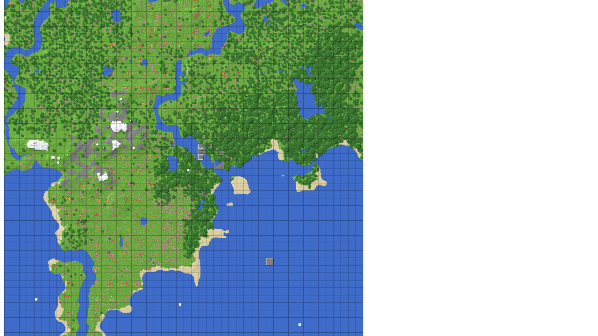

# WebChunkMap

给 Cuberite **WebAdmin** 加一个「区块地图」标签页：把世界的方块 / 区块数据渲染到浏览器的
canvas 上，可以直接平移、缩放、切换图层，还能点选区块做管理。



### 渲染在浏览器里做

服务端不再逐像素画图，而是把每个区块**预打包好的调色板 + 高度 + 状态**拼成一份二进制
deflate 下发，颜色展开 / 山体阴影 / 区块网格线全部由 `canvas.js` 在浏览器里完成。

**为什么值得**（48x48 视野 = 2304 个区块的实测）：

| | 传输 | 服务端每次渲染 | 浏览器 |
| --- | --- | --- | --- |
| 服务端画 PNG | 95.1 B/区块 | **~260 ms（占世界 tick 线程）** | — |
| 浏览器画 canvas | 95.5 B/区块 | **~34 ms**（只剩拼块 + deflate）| ~35 ms |

也就是**传输体积几乎不变**，换来渲染彻底离开服务端 —— 以前每换一个视野就要占着世界
tick 线程 200 多毫秒，现在只剩三十几毫秒，而且与缩放到几倍无关（放大由
`image-rendering: pixelated` 做最近邻，与"服务端复制像素"完全等价）。

需要浏览器支持 `DecompressionStream`（Chrome 80+ / Firefox 113+ / Safari 16.4+）。
不支持时页面会自动提示，并给一个「改用服务端 PNG」的链接；也可以直接用
`?canvas=0` 强制走 PNG 路径（那条路没有动，仍是原来的纯 Lua 实现）。
想彻底关掉画布就把 `[Render] CanvasOnly` 设 0。

## 使用

在服务器根目录 `settings.ini` 的 `[Plugins]` 段加一行 `WebChunkMap=1`（或用
`cuberite_plugin_enable` 热加载），然后打开：

```
http://<服务器>:<WebAdmin 端口>/webadmin/WebChunkMap/map
```

端口不是固定的，取服务器根目录 `webadmin.ini` 里的 `[WebAdmin] Ports`（可能是逗号分隔的多个）。
懒得找的话，在游戏里执行 `/chunkmap`、或控制台执行 `chunkmap status`，
插件会直接把它按实际端口拼好的地址打出来。

WebAdmin 需要登录，账号看 `webadmin.ini` 的 `[User:*]` 段。

## 三种图层

| 图层 | 说明 |
| --- | --- |
| **地表** | 俯视地表，按顶层方块上色，带高度差阴影，标出在线玩家与出生点 |
| **生物群系** | 按群系上色 |
| **区块状态** | 已加载 / 记忆中的快照 / 从未见过 |

每 16 格有一条暗色区块边界线。

## "曾经加载过"的地形会留下来

区块只要被加载过一次，就会留下一份很小的渲染快照（约 1.25 KiB，只存顶面颜色、地表高度和群系，
不是方块数据）。之后即使引擎把区块卸载了，地图上依然能画出那片地形。

快照会自动存盘（`cache/tiles.bin`），重启服务器后仍在。想清掉某个世界：
控制台执行 `chunkmap forget <世界名> all`。

> 一开始地图上大部分是暗的，属于正常：Cuberite 只在玩家附近保持区块加载。
> 见下面的"自动补全"。

## 平移与自动补全

页面顶部有 北 / 南 / 西 / 东 / 缩小 / 放大 / 回到出生点。

- **自动补全**：每次渲染后自动把视野里"从未见过"的区块排进加载队列，一路平移过去地图会自己补全。
- **⏬ 加载可见区块**：手动按钮，同样从未见过的优先，已有快照的排在其后。

> 自动补全会真的生成新地形，和玩家走过去一样有 CPU 开销。不想要就在 `settings.ini` 里设
> `[Cache] AutoLoadOnView=0`。

## 点选区块做管理

点击地图上的区块即可选中 / 取消（支持多选）。选中的区块会高亮，并在下方列出坐标、范围、状态、
生物群系、地表高度、顶层方块、实体与玩家数，并提供：

**定位** · **加载这些区块** · **清除记忆** · **重新生成**（需勾选确认）· **传送到第 1 个选中区块**

其中"清除记忆"只删本地快照，不动世界数据。

## 配置

首次启动时插件会从 [settings.ini.example](settings.ini.example) 复制出一份 `settings.ini`——
**这份文件不进版本库**，所以每台机器（本机 / raspi / 别的服务器）都可以随便改，
既不会弄脏工作区，也不会和 `git pull` 打架。文件内有逐项注释，最常用的几项：

| 段 | 键 | 作用 |
| --- | --- | --- |
| `[Web]` | `TabTitle` | 标签页名称 |
| | `DefaultSizeChunks` / `DefaultScale` / `DefaultMode` | 打开时的默认视野 |
| `[Render]` | `CacheTTL` | 缓存的后台刷新阈值（秒）。不影响页面响应；想立刻更新勾「强制重绘」 |
| | `CanvasOnly` | **只要画布数据、不出 PNG**。这是省掉 200+ ms 的关键；设 0 就退回服务端画图 |
| | `ShadeDownsample` | 山体阴影降采样倍率（1 = 每像素都算；2 省 22% 渲染，代价是悬崖阴影边界挪一格）|
| | `DrawChunkGrid` / `HillShading` / `DrawPlayers` | 图层元素开关 |
| | `DrawStructures` | 在地图上标出结构位置（依赖 VanillaFeatureComplement） |
| `[Cache]` | `RememberChunks` | 是否记住曾经加载过的区块 |
| | `MaxChunks` | 快照数量上限 |
| | `MaxLoadedChunks` | **已加载区块总量阀门**（0 = 不限）。小内存机器务必设置，见下 |
| | `MaxWarmChunks` | 手动「加载可见区块」单次上限（默认 512 ≈ 100 MB 常驻内存，树莓派建议 32~64） |
| | `AutoLoadOnView` | 平移时是否自动补全地形 |

## 命令

- 玩家：`/chunkmap` —— 显示地图地址与快照状态
- 控制台：`chunkmap status | flush | save | forget <世界名> all | render [世界名] [cx] [cz] [视野] [缩放]`

---

改代码前请先读 [AGENTS.md](AGENTS.md)：里面记录了**两条会导致整个服务器 abort 的线程规则**。
